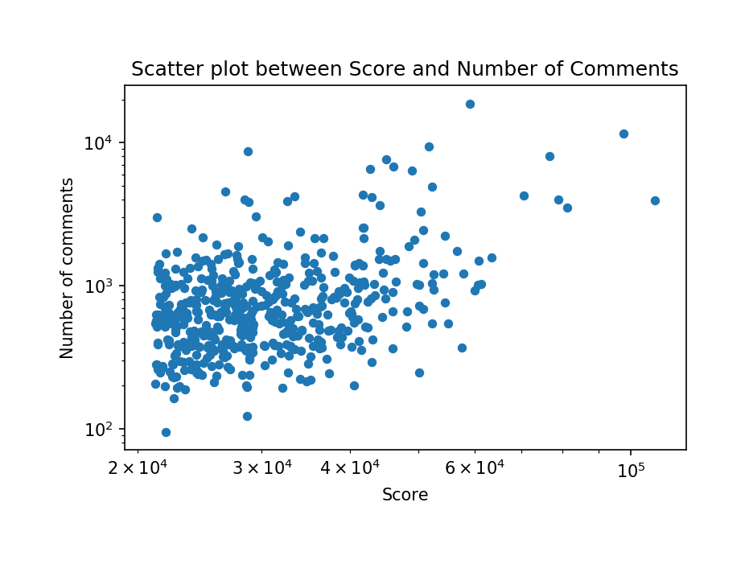
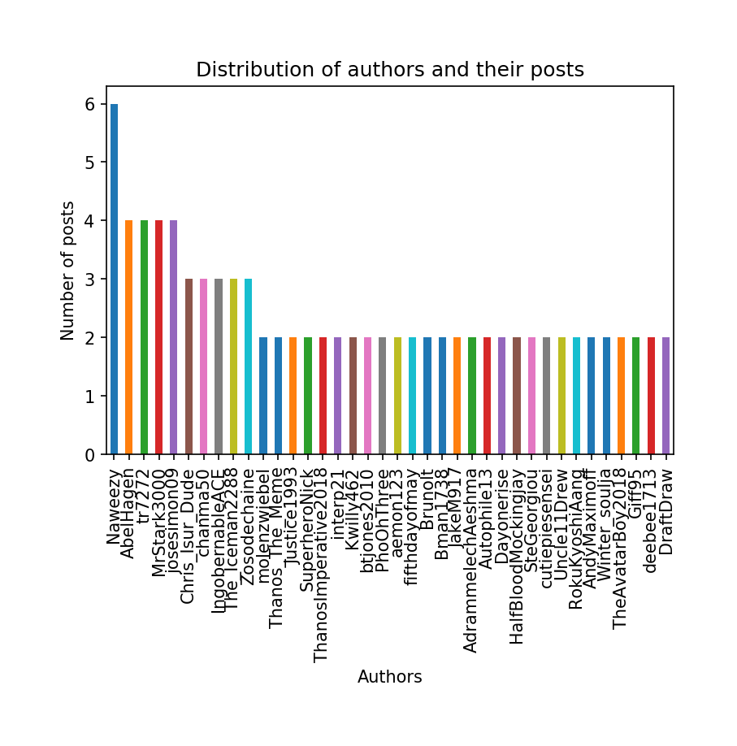
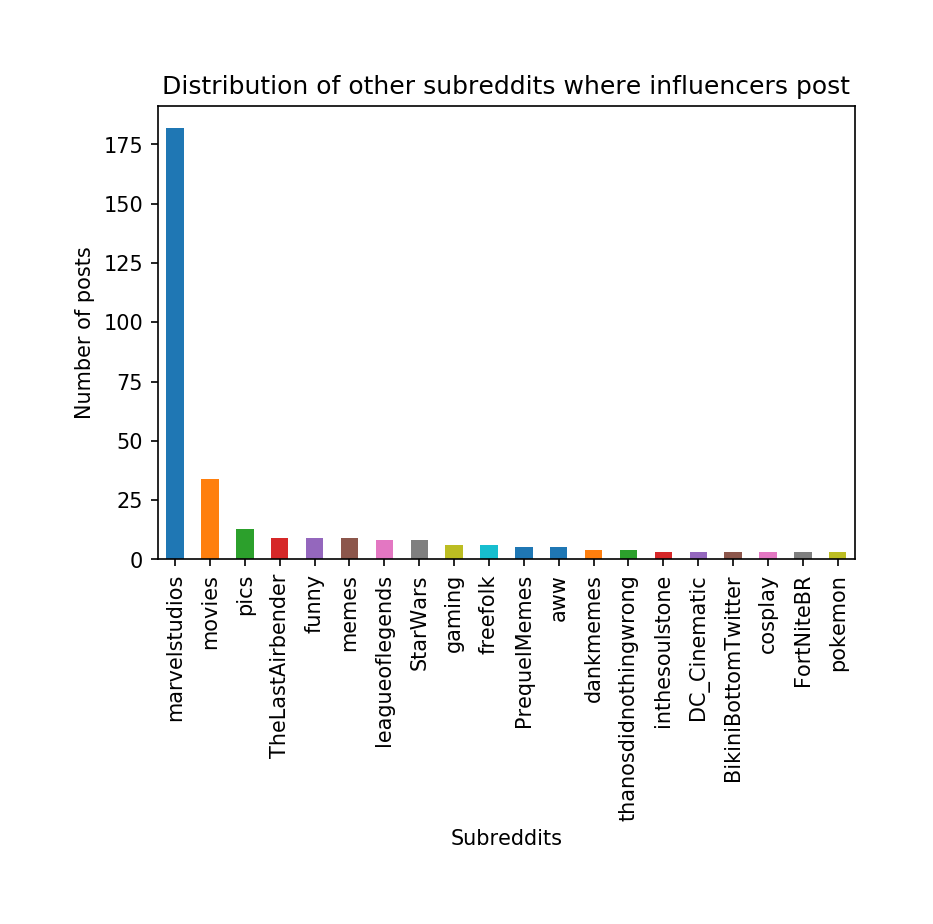
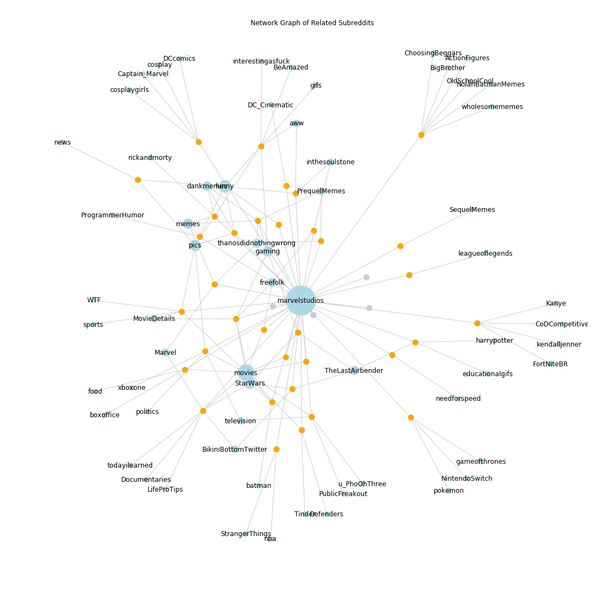

# 
 Network Analysis of Reddit 

## Problem Identification

Reddit is a massive social media platform that differs from the mainstream in the sense it is content-centric, rather than user-centric. Users don’t follow their favorite redditors but instead subscribe to “subreddits” centered around different topics or communities. This leads to all kinds of differences in the content, structure, and culture of Reddit, but like all frameworks, it has its limitations.

One glaring blindspot in this system is that one cannot at a glance see which users are influential. Other social media platforms have follower counts which directly quantify the amount of reach a user is likely to have, while redditors only have karma i.e the net total up and down votes since account creation, and a log of their posts and comments in different subreddits. The two statistics collectively give a rough idea of a user’s activity, but the setup obscures which users are influential in individual subreddits. 

Subreddits being the core categories of content aggregation, there is a real problem in understanding where Reddit’s most viewed content comes from. The critical question we hope to answer with this paper is **How can we use influencers on Reddit to form a network of related subreddits?**

## The Process

It has already been found that a very small percentage of Reddit’s users create the vast majority of the site’s content, so we would not be surprised if only a few users could influence the discourse of entire subreddits. Identifying these users would help us understand how Reddit’s “voice” is shaped.
We took a top down approach towards analyzing a particular subreddit.
- Search a subreddit’s top 500 most upvoted posts of all time
- Drill down into these posts and analyze the users who posted
- We define ‘influencers’ as those who appeared more than once
- Drill down into top submissions by user to find where else do they have influence
- Map related subreddits and influencers in a network graph

## Approach

### 3.1 Data Acquisition

The first step before we can draw any kind of insight from a social media platform is acquiring the data itself. We decided to use PRAW - The Python Reddit API Wrapper to meet our needs for grabbing user data from active subreddits. A Reddit account is required to access Reddit’s API. Next, we needed the Client ID and Client Secret to access Reddit’s API as a script application. Reddit’s documentation on their <a href = "https://github.com/reddit/reddit/wiki/OAuth2-Quick-Start-Example#first-steps">First Steps Guide</a> to generate keys walks you through the process. 

For our needs to scrape data, we needed a Read-Only instance of Reddit using PRAW. To create a read-only Reddit instance, we also needed a user agent which is a unique identifier that helps Reddit determine the source of network requests.

Next, we wrote a function to fetch a particular number of posts in a subreddit. 
`get_posts` takes two parameters, `sub_name` and `n`, it returns a Pandas data frame comprised of a list of top n posts in a subreddit. We store each post’s id, score (net score of upvotes and  downvotes), number of comments and the subreddit it was made in. For the purposes of our initial analysis, we picked _r/marvelstudios_, a subreddit focussed on the Marvel cinematic universe content. 

| Number of active users | 822,000 |
| --- | --- |
| Average posts/day: 	 | 353 |
| Average comments/day:  | 4,038 |

### 3.2 Data Pre-processing

In order to ensure our data was free of any discrepancies, we cleaned any null (deleted) users that made the top posts in a subreddit.  We gathered the repeating posters who made it to the top posts of all time in a subreddit and cleaned that data frame of any null values.

### 3.3 Exploratory Analysis
**Part 1**  
Analyzing the top 500 posts of all time on _r/marvelstudios_ revealed some interesting insights about Reddit posts. In figure 1, the scatter plot shows that the number of comments don’t necessarily increase with posts that have a higher net score. 

Figure 1: Scatter plot of number of comments and net score of top 500 posts

The number of comments stays fairly unchanged in the range of posts scores of 20,000 and 60,000. Our initial hypothesis was to see a directly proportional relationship between the number of comments and score. We observed a similar scatter plot for r/all on a larger scale. 

**Part 2**  
Next, we analyzed recurring users whose posts made it to the top 500 of all time. We found that only 13% of the users appeared more than once on the top posts of _r/marvelstudios_. We are led to believe it varies by a given subreddit. Following our process from Section 2, we scraped the top 10 posts of every user. We made a bar graph of number of submissions made by recurring users in _r/marvelstudios_

Our definition of an Influencer came from analyzing this bar graph. We realized that the cut-off for being influencer each subreddit would be subjective to the size of the subreddit and how often submissions are made. The cut-off we decided for this particular subreddit was 2 or more submissions in top posts of all time. 

**Part 3** 
Next, we analyzed where else did these top posters had influence by compiling a list of authors that appeared more than once on other subreddits. 
In order to form a network graph, we needed data about the particular subreddits where our influencers appeared. For the sake of simplicity, we visualized those subreddits with at least 2 or more posts made by the influencers. The Y-axis is the number of submissions and the X-axis are the respective subreddits.

### 3.4 Building the model
One of the challenges we faced was visualizing the data we had acquired in a network graph. It was an interesting change of dynamic from thinking about data the form of rows and columns to nodes and edges. 

We decided we needed to use a more standardized approach so we used the spring layout NetworkX has to offer. In order to have some form of convention, we decided to draw the edges thin and grey. Influencer nodes appear small and grey. Meanwhile, the subreddits appear in blue and sized according to their respective number of connections. To keep things tidy, we only labeled the subreddits. Finally, the influencers who have more connections than just _r/marvelstudios_ are highlighted in yellow.

## Future Work

In conclusion, we were able to achieve a network graph of related subreddits based on our process. A few caveats worth mentioning is that our definition of an ‘influencer’ is very naive. Finding a threshold for an “influencer” is subjective to the subreddit under observation and depends on metrics such as user engagement and subreddit size. Our sample of top 500 posts in a subreddit may produce somewhat limited results if a certain influencer skews the dataset by appearing too often. 

If we were to continue this project, we would account for user comments to be a contributing factor in narrowing down influencers. Since Reddit threads are hierarchical, analyzing user comments  would involve an exponentially long time to process without optimization. However, given the time and computational constraints, we didn’t get a chance to explore influence along the comments avenue. Moreover, it would be an interesting challenge to improve our algorithm for finding subreddit similarity based on posts and comments and see if one methodology produces better results than the other.